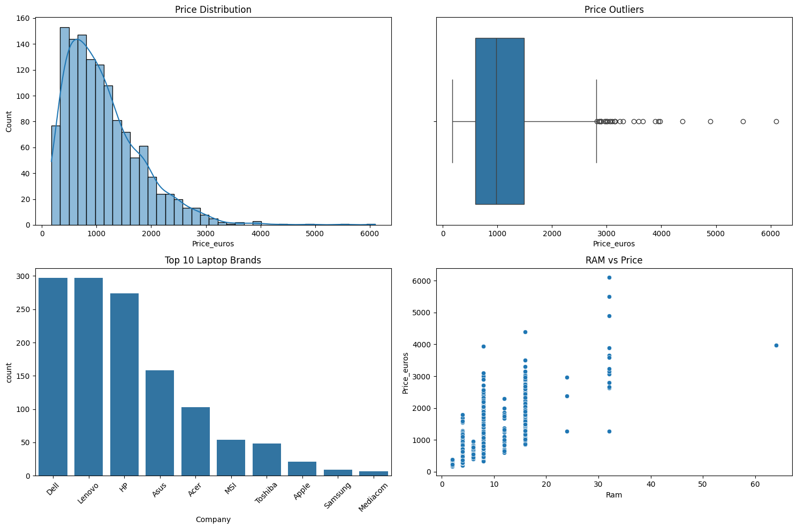
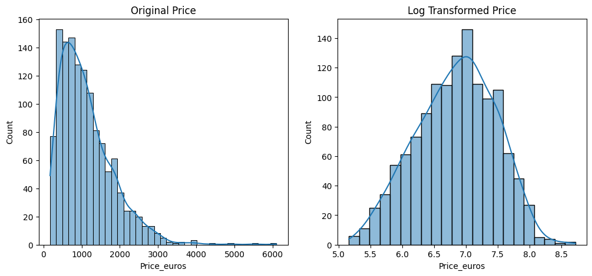
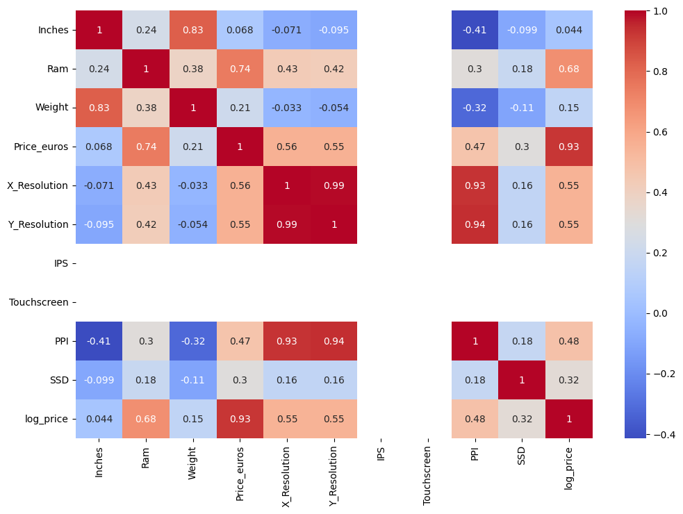
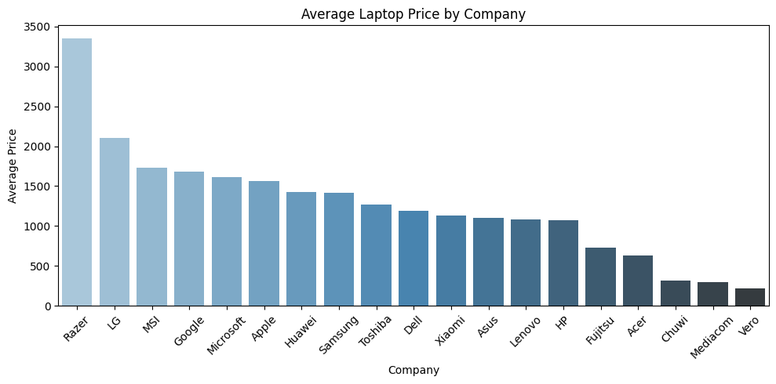
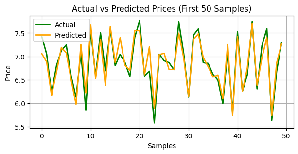
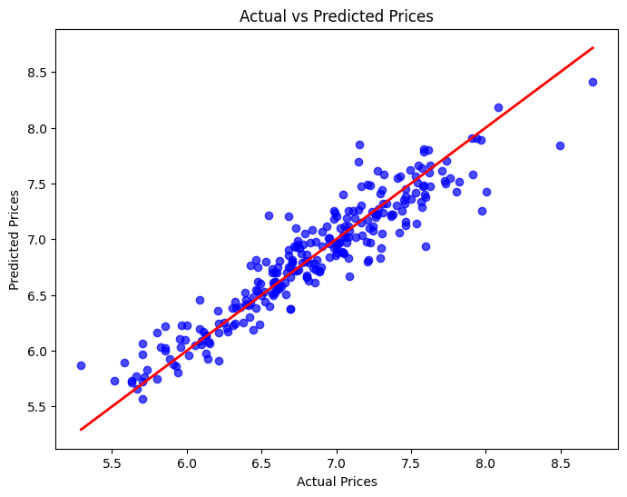
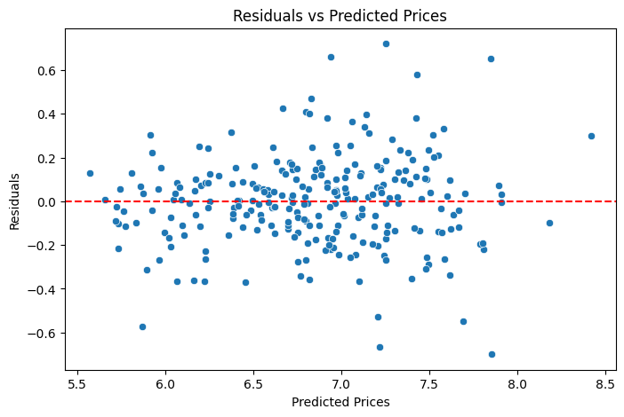

# 💻 Laptop Price Prediction Using Machine Learning

## End-to-End Machine Learning Regression Project

Predicting laptop prices using hardware specifications and device characteristics through a complete machine learning workflow.

---

# 📌 Project Overview

This project develops a machine learning model capable of predicting laptop prices based on hardware specifications, display characteristics, storage configurations, operating systems, and manufacturer information.

The project demonstrates a complete end-to-end machine learning workflow including:

* Data Cleaning
* Exploratory Data Analysis (EDA)
* Feature Engineering
* Data Preprocessing
* Log Transformation
* Model Training
* Model Comparison
* Cross Validation
* Hyperparameter Tuning
* Model Evaluation
* Residual Analysis
* Model Persistence

---

# 🎯 Problem Statement

Can laptop prices be accurately predicted using hardware specifications and device characteristics?

Laptop prices depend on several factors including:

* Processor Type
* RAM Capacity
* Storage Configuration
* GPU Type
* Screen Resolution
* Display Quality
* Operating System
* Brand

This project aims to identify the most influential factors affecting laptop prices and build a reliable predictive model.

---

# 📊 Dataset Information

Dataset Source: Laptop Price Dataset

### Dataset Shape

* Records: 1303
* Features: 13 Original Features

### Target Variable

* Price_euros

---

# 🔍 Exploratory Data Analysis

EDA was performed to understand:

* Feature distributions
* Price distribution
* Outliers
* Brand-wise pricing trends
* Correlations between variables
* Relationships between hardware specifications and price

### Key Insights

* RAM shows a strong positive relationship with laptop price.
* Premium brands generally have higher average prices.
* Display quality significantly influences pricing.
* Laptop prices exhibit a right-skewed distribution.

---

# ⚙️ Feature Engineering

Several domain-driven features were created to improve model performance.

### Display Features

* IPS
* Touchscreen
* X_Resolution
* Y_Resolution
* PPI (Pixels Per Inch)

### CPU Features

* CPU_Brand
* Cpu_Series

### GPU Features

* Gpu_Brand
* Gpu_Type
* Gpu_Series

### Storage Features

* SSD Capacity
* Memory_Type

### Product Feature Experiment

An additional experiment was conducted by removing the Product feature from the dataset.

Although including Product slightly improved predictive performance, the model became highly dependent on specific product names.

Removing Product improved interpretability and allowed the model to learn relationships from actual hardware specifications.

---

# 📷 Project Visualizations

## Price Distribution



## Log Transformed Price



## Correlation Heatmap



## Average Laptop Price by Company



## Actual vs Predicted



## Actual vs Predicted Scatter Plot



## Residual Analysis



---


# 📈 Target Transformation

The target variable exhibited positive skewness.

A logarithmic transformation was applied:

```python
y = np.log(data['Price_euros'])
```

Benefits:

* Reduced skewness
* Reduced effect of outliers
* Improved regression performance
* Better approximation to a normal distribution

---

# 🏗️ Machine Learning Pipeline

Raw Data

↓

ColumnTransformer

├── StandardScaler (Numerical Features)

└── OneHotEncoder (Categorical Features)

↓

Ridge Regression

↓

Predicted Laptop Price

Benefits:

* Prevents data leakage
* Simplifies deployment
* Ensures reproducibility
* Combines preprocessing and modeling

---

# 🤖 Models Compared

The following algorithms were evaluated:

* Linear Regression
* Ridge Regression
* Lasso Regression
* Random Forest Regressor
* Support Vector Regression (SVR)
* Decision Tree Regressor
* K-Nearest Neighbors Regressor

---

# 📊 Cross Validation

5-Fold Cross Validation was performed on the training set.

### Results

* Mean Cross Validation R² Score: 0.8411

The low variation between folds indicates stable model performance and good generalization.

---

# 🔧 Hyperparameter Tuning

GridSearchCV was used to optimize the Ridge Regression model.

### Best Parameters

```python
{'model__alpha': 1}
```

### Best Cross Validation Score

```text
0.8411
```

---

# 🏆 Final Model Selection

Ridge Regression was selected as the final model because:

* Strong predictive performance
* Stable cross-validation results
* Better interpretability
* Robustness against multicollinearity
* Consistent generalization on unseen data

---

# 📈 Final Model Performance

| Metric   | Score  |
| -------- | ------ |
| R² Score | 0.8409 |
| MAE      | 0.1874 |
| RMSE     | 0.2375 |
| MSE      | 0.0564 |
| CV R²    | 0.8411 |

### Interpretation

The model explains approximately 84% of the variation in laptop prices and demonstrates strong predictive performance on unseen data.

---

# 🔬 Residual Analysis

Residual analysis confirms:

* Residuals centered around zero
* No obvious patterns
* Good model fit
* Stable prediction performance

This indicates that the model generalizes well and does not exhibit significant bias.

---

# 🏆 Feature Importance (Coefficient Analysis)

Feature coefficient analysis revealed that laptop pricing is primarily influenced by:

* CPU Series
* GPU Series
* RAM Capacity
* SSD Capacity
* Operating System
* Display Characteristics
* Manufacturer Brand

The analysis highlights the importance of hardware specifications in determining laptop prices.

---

# 💾 Model Persistence

The final model was saved using Joblib.

```python
import joblib

joblib.dump(best_model, "models/laptop_price_model.pkl")

model = joblib.load("models/laptop_price_model.pkl")
```

---

# 🛠️ Technologies Used

* Python
* Pandas
* NumPy
* Matplotlib
* Seaborn
* Scikit-Learn
* Joblib
* Jupyter Notebook

---

## 📂 Project Structure

```text
laptop-price-prediction/
├── data/
│   └── laptop_price.csv
├── notebooks/
│   └── laptop_price_prediction.ipynb
├── images/
│   ├── price_distribution.png
│   ├── correlation_heatmap.png
│   ├── actual_vs_predicted.png
│   ├── actual_vs_predicted_scatterplot.png
│   ├── residual_plot.png
│   ├── avg_laptop_price.png
│   └── original_price_vs_log_transformed_price.png
├── models/
│   └── laptop_price_model.pkl
├── requirements.txt
├── .gitignore
└── README.md


```

# 🚀 How To Run

```bash
git clone https://github.com/rohanjtech/laptop-price-prediction.git

cd laptop-price-prediction

pip install -r requirements.txt

jupyter notebook
```

Open:

```text
notebooks/laptop_price_prediction.ipynb
```

Run all cells.

---

# 📚 Key Learnings

* Feature Engineering
* Data Preprocessing
* Machine Learning Pipelines
* Regression Modeling
* Cross Validation
* Hyperparameter Tuning
* Residual Analysis
* Model Interpretation
* Model Serialization

---

# 👨‍💻 Author

Rohan Janardan Pagare

Machine Learning Enthusiast | Data Science Learner | Python Developer

GitHub:
https://github.com/rohanjtech

LinkedIn:
https://www.linkedin.com/in/rohan-pagare-5a0444249/

---
